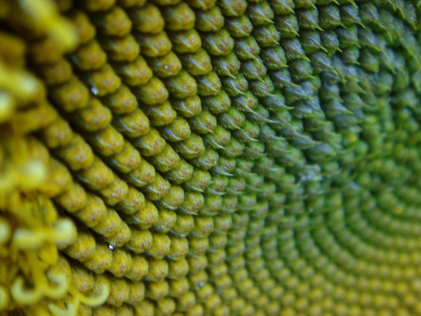

# Sunflower-Seed-Patterns

<h2>Why are sunflower seeds arranged the way they are?</h2>

Image credit: "Sunflower Seeds"</a> by <a href="https://www.flickr.com/photos/84202567@N00">dogbomb</a> is licensed under <a href="https://creativecommons.org/licenses/by/2.0/?ref=ccsearch&atype=html" style="margin-right: 5px;">CC BY 2.0</a>

The particular pattern in the way sunflower seeds grow aims to minimize, as much as possible, the amount of wasted space. And it has been discovered that this pattern is caused by a constant angle of rotation between the newest seed and the next one to be grown. What angle of rotation will achieve this? Incredibly, that angle is equal to &Phi; (~0.61803 or 1.6803), multiplied by 2&#120587; (aka a full turn). So, in the picture you see above, the angle between consecutive seeds is equal to &Phi; times a full turn. Amazing, right?

<h2>Why &Phi; is the best</h2>

How come &Phi, also known as <i>the golden ratio</i>, multiplied by a full turn gives you the optimal pattern for the growth of sunflower seeds? What's wrong with 1/3 of a full turn, or 1/10 of a full turn, or something like 1/<i>e</i> times a full turn? Well, let's put some of these other turn sizes to the test and it'll become clear to you.

<h3>Rotating by 1/3 of a full turn</h3>
Here is the outcome of rotating by 1/3 of a full turn before sprouting a new seed:

<h3>Rotating by 1/10 of a full turn</h3>

  
<h3>Rotating by 5/6.02 of a full turn</h3>
  

<h3>Rotating by 1/2.01 of a full turn</h3>
  

You may have noticed that the number of spiral arms in the seed pattern corresponds to the denominator of the turn size. This is clear for the turn sizes of 1/3, and 1/10, as you can clearly see their results of 3 arms and 10 arms, respectively. But for the latter two turn sizes, 5/6.02, 1/2.01, this is less clear, but still noticeable, since the denominators are close to an integer, but not quite an integer. In any case, it seems that the denominator of the turn size corresponds to the number of spiral arms. And it seems like spiral arms tend to waste a lot of space. So we want to avoid patterns with spiral arms.

<h3>Rotating by &#8730;2/2 of a full turn</h3>

<h3>Rotating by 1/<i>e</i> of a full turn</h3>

These two turn sizes are both irrational, meaning they can't be expressed as an integer over another integer (or an integer over an almost-integer, like 5/6.02 or 1/2.01). So irrational numbers can't be expressed as fractions, so they don't have a denominator, and so irrational tend to not create any spiral arms (they do, but, as you can see from th GIFs, they aren't well defined.

