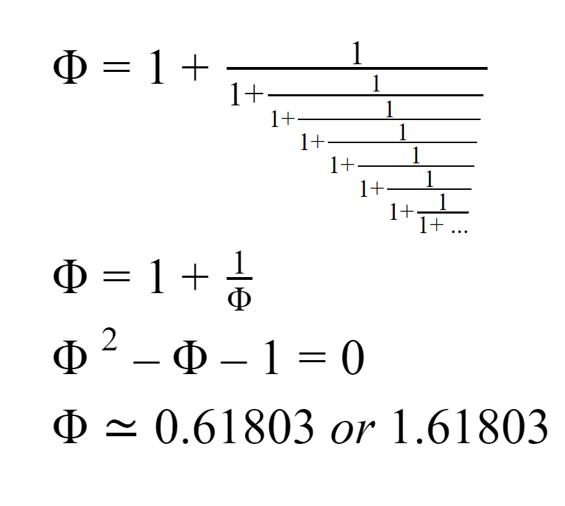

# Sunflower-Seed-Patterns

<i>Sunflower-Seed-Patterns</i> is a program that simulates the growth of sunflower seeds. It allows the user to set the angle of rotation between new seeds, which results in different patterns.

There is some interesting math behind these patterns. Read on to learn more.

<h2>Why are sunflower seeds arranged the way they are?</h2>

Image credit: "Sunflower Seeds"</a> by <a href="https://www.flickr.com/photos/84202567@N00">dogbomb</a> is licensed under <a href="https://creativecommons.org/licenses/by/2.0/?ref=ccsearch&atype=html" style="margin-right: 5px;">CC BY 2.0</a>

Sunflowers in nature grow in a very special way. The particular pattern in which sunflower seeds grow aims to minimize the amount of wasted space on the seed head. And it has been discovered that this pattern is caused by a constant angle of rotation between the newest seed and the next one to be grown. What angle of rotation will achieve this? Incredibly, that angle is equal to &Phi; (~0.61803 or 1.6803), multiplied by 2&#120587; (aka a full turn). So, in the picture you see above, the angle between consecutive seeds is equal to &Phi; times a full turn. Amazing, right?

<h2>Why &Phi; is the best</h2>

How come &Phi;, also known as <i>the golden ratio</i>, multiplied by a full turn gives you the optimal pattern for the growth of sunflower seeds? What's wrong with 1/3 of a full turn, or 1/10 of a full turn, or something like 1/<i>e</i> times a full turn? Well, let's put some of these other turn sizes to the test and it'll become clear to you.

<h3>Rotating by 1/3 of a full turn - A turn size of 1/3 produces this pattern:</h3>

<h3>Rotating by 1/10 of a full turn - A turn size of 1/10 produces this pattern:</h3>

  
<h3>Rotating by 5/6.02 of a full turn - A turn size of 5/6.02 produces this pattern:</h3>

  

<h3>Rotating by 1/2.01 of a full turn - A turn size of 1/2.01 produces this pattern:</h3>

  

You may have noticed that the number of "arms" in the seed pattern corresponds to the denominator of the turn size. This is clear for the turn sizes of 1/3, and 1/10, as you can clearly see their results of 3 arms and 10 arms, respectively. But for the latter two turn sizes, 5/6.02, 1/2.01, this property is less obvious, but still noticeable, since the denominators are close to an integer, but not quite an integer. As a result, rather than straight arms, you get curvy spirals, with the number of spirals basically equal to the denominator of the turn size. In any case, it seems that the denominator of the turn size corresponds to the number of arms/spirals. And it seems like these clearly-defined arms/spirals tend to waste a lot of space. So we want to avoid patterns with arms/spirals like these.

<h3>Rotating by &#8730;2/2 of a full turn - A turn size of &#8730;2/2 produces this pattern:</h3>

<h3>Rotating by 1/<i>e</i> of a full turn - A turn size of 1/<i>e</i> produces this pattern:</h3>

These two turn sizes are both irrational, meaning they can't be expressed as an integer over another integer (or an integer over an almost-integer, like 5/6.02 or 1/2.01). Since irrational numbers can't be expressed as fractions, we can't say that the number of spiral arms corresponds to the denominator of the turn size. And you can observe this visually too as the turn sizes &#8730;2/2 and 1/<i>e</i> don't create well-defined spiral arms like 1/10 and 1/3, or even like 5/6.02, or 1/2.02. But they still create <i>some</i> kind of spiral arms. Why? Well, both of these irrational turn sizes can be well-approximated by a rational number. &#8730;2/2 can be well-approximated by 7071/10000. Likewise, 1/<i>e</i> can be well-approximated by 32/87. Thus, both of these turn sizes result in patterns with spiral arms, just not spiral arms you can easily see. The patterns are very space-efficient (certainly better the ones created by turn sizes of 1/10 and 1/3), but not perfect, as they still have spiral arms that create little pockets of wasted space.

 What can be learned from this is that &#8730;2/2 and 1/<i>e</i> are irrational, just not <i>irrational enough</i>. Between the two, however, you could make the claim that &#8730;2/2 is "more" irrational than 1/<i>e</i> because the denominator of its rational approximation is much bigger, which means that if you substituted a turn size of &#8730;2/2 for its rational approximation, you'd get a pattern with lots and lots of spirals clustered together, which are much harder to identify and count. And we can verify this by looking at the pattern for &#8730;2/2 above.

 To get the perfect turn size to create the perfect, most space-efficient pattern, we need the <i>most irrational</i> number. 

<h2> Finding the <i>most irrational</i> number </h2>

The following is called a <i>continued fraction</i>:

What's special about this particular continued fraction is that it converges towards the value of &Phi; (the farther down you go, the closer the value of the continued fraction gets to &Phi;). Thus, we can't get a good rational approximation of &Phi; early on in the continued fraction, because if we cut off the fraction early on, the part we would be chopping off would still be significant, making our approximation bad. That means that a good approximation of &Phi; will have a big denominator. An example is shown below:

As you can see, &Phi; is well-approximated by 144/89 (which are actually consecutive numbers in the Fibonacci sequence). But the approximation gets better and better as you go further down the continued fraction. So the better the approximation gets, the larger the denominator of the approximation will get, which means the seed pattern created by a turn size equal to the approximation is going to have lots and lots of spiral arms. And as we saw with, the pattern for  &#8730;2/2, lots and lots of spiral arms are very difficult to discern and save a ton of space.

Solving for &Phi;, we get: 

 And now, as you can see, a turn size of &Phi; (0.61803) gives us that "perfect" pattern. 

<h2> Now try the program yourself! </h2>

